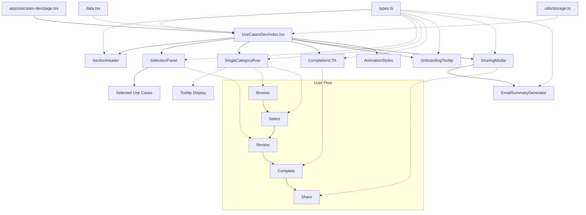

# UseCasesDev Component

This directory contains a development version of the UseCases component with improved UX and functionality. The component allows users to browse, select, and manage AI use cases across different categories.

## Component Structure

```
UseCasesDev/
├── index.tsx                 # Main entry point and container component
├── types.ts                  # Type definitions and shared constants
├── data.tsx                  # Use case data and category icons
├── AnimationStyles.tsx       # Global animation styles
├── SectionHeader.tsx         # Header component with title and instructions
├── SelectionPanel.tsx        # Panel for displaying and managing selected use cases
├── SingleCategoryRow.tsx     # Horizontal scrollable row of use case cards
├── CompletionCTA.tsx         # Call-to-action shown when selection is complete
├── OnboardingTooltip.tsx     # First-time user onboarding tooltip
├── SharingModal.tsx          # Modal for sharing selections
├── EmailSummaryGenerator.tsx # Email generation tool for sharing selections
├── scrollbar-hide.css        # CSS for hiding scrollbars
└── utils/
    └── storage.ts            # Client-side storage utilities
```

## Component Flow

1. **Initialization**:
   - `index.tsx` initializes state and loads any saved selections from storage
   - Progressive reveal animation shows UI elements in sequence
   - First-time users see the `OnboardingTooltip`

2. **Browsing Use Cases**:
   - `SingleCategoryRow` displays all available use cases in a horizontal scrollable row
   - Users can hover over cards to see tooltips with more information
   - Animation speeds adjust based on user interaction

3. **Selection Process**:
   - Users click on use case cards to select them (up to 3 selections)
   - When first selection is made, `SelectionPanel` appears
   - Selected use cases can be reordered by priority
   - Users can add personal notes to each selection
   - System can recommend related use cases based on current selections

4. **Completion**:
   - When 3 use cases are selected, the selection is considered complete
   - `CompletionCTA` becomes visible, encouraging the user to continue their journey
   - Selections are saved to local storage for persistence

5. **Sharing**:
   - Users can share their selections via the `SharingModal`
   - `EmailSummaryGenerator` allows creating formatted email summaries
   - Share URL can be generated to share selections directly

## Visual Component Flow



## Key Features

- **Single Row Layout**: Unlike the original component with multiple rows, this version uses a single row with category labels
- **Improved Mobile Experience**: Touch-friendly with smooth scrolling and snap points
- **Visual Feedback**: Animations, tooltips, and visual cues guide the user through the selection process
- **Persistence**: Selections are saved to localStorage and can be restored on return visits
- **Accessibility**: Keyboard navigation, ARIA attributes, and proper focus management

## State Management

The component uses React's useState and useEffect hooks for state management:

- **Selection State**: Tracks selected use cases, their order, and user notes
- **UI State**: Manages visibility, animations, and interactive elements
- **User Preferences**: Remembers user choices and settings

## Usage

The component is imported and used in `app/usecases-dev/page.tsx` for development and testing purposes.

## Comparison with Original UseCases Component

| Feature | Original UseCases | UseCasesDev (New) |
|---------|------------------|-------------------|
| **Layout** | Three separate rows for each category | Single unified row with category labels |
| **Animation** | Continuous marquee animation | Smart animation that responds to user interaction |
| **Selection UX** | Basic selection with limited feedback | Enhanced selection with visual feedback and animations |
| **Mobile Experience** | Limited mobile optimization | Fully responsive with touch-friendly interactions |
| **Tooltip System** | Basic tooltips | Enhanced tooltips with better positioning and z-index management |
| **Component Structure** | Tightly coupled components | Modular, self-contained components |
| **Visual Hierarchy** | Equal emphasis on all categories | Clear visual hierarchy with category labels |
| **Performance** | Multiple animation loops | Optimized animations with pause/resume functionality |

### Key Improvements

1. **Simplified Navigation**: Consolidated three rows into a single scrollable row, reducing cognitive load
2. **Enhanced Tooltips**: Fixed tooltip positioning and z-index issues to prevent cutoff
3. **Responsive Design**: Better mobile experience with proper touch handling and scroll snap points
4. **Visual Feedback**: Improved visual cues for selection, recommendations, and completion
5. **Performance**: Optimized animations and rendering for smoother experience
6. **Maintainability**: Modular component structure with clear separation of concerns
